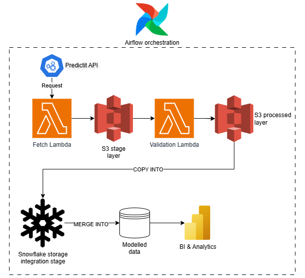

# Predictit Market Data Ingestion Pipeline

## Overview

This project implements a batch data ingestion pipeline that polls the PredictitAPI for US political odds data. The goal is to demonstrate a production-ready system using a modern data stack tooling that can be used to generate analysis and identify trends.

The project follows a microservices architecture pattern with code processing services deployed as AWS Lambda functions, raw data stored in S3 and modelled data loaded into Snowflake. The pipeline is orchestrated using Airflow into a fetch and ingestion DAG. AWS infrastructure is managed using Terraform, and CI/CD is enabled using GitHub Actions ensuring robust code which is immediately deployed.

## Tech Stack

- 🐍 Python: API client, response valiation & Lambda logic
- ☁️ AWS S3: Raw and validated data storage
- 🧬 AWS Lambda: Stateless functions for API fetching & validation
- ❄️ Snowflake: Data warehouse
- 🛠️ Terraform: Infrastructure as code
- 🔄 Airflow: Pipeline orchestration
- 🚀 GitHub Actions: CI/CD automation

## Architecture Diagram



## Project Structure

```
predictit/
├── .github/workflows             # GitHub Actions workflows
│   ├── deploy_lambdas.yml        # Reuseable workflow for Lambdas continuous deployment
│   ├── test_and_deploy.yml       # Main workflow to run tests and deploy to AWS
│   ├── test.yml                  # Reuseable workflow to check and format code and run tests

├── dags/                         # Airflow DAGs for orchestration
│   ├── fetch.py                  # DAG to fetch data from PredictIt API
│   ├── ingest.py                 # DAG to ingest data into Snowflake
│   └── sql/                      # Snowflake SQL scripts (DDL/COPY INTO/etc.)
│
├── docs/                         # Documentation and diagrams
│   └── architecture-diagram.png  # Pipeline architecture diagram
│
├── infrastructure/aws            # Terraform modules
│   ├── iam/                      # IAM roles and permissions
│   ├── lambdas/                  # Lambda deployment resources
│   └── s3/                       # S3 bucket
│
├── lambda_fetch/                 # Fetch Lambda (PredictIt API ingestion)
│   └── __init__.py
│   ├── Dockerfile
│   ├── lambda_function.py
│   ├── requirements.txt
│
├── lambda_validate/              # Validate Lambda (schema/structure checks)
│   └── __init__.py
│   ├── Dockerfile
│   ├── lambda_function.py
│   ├── requirements.txt
│
├── src/                          # Python source code
│   └── __init__.py
│   ├── api.py                    # API fetch and request logic
│   ├── validate.py               # API response validation schema definitions

│
├── tests/                        # Unit tests
│   └── __init__.py
│   ├── test_api.py
│   ├── test_lambda_fetch.py
│   ├── test_lambda_validate.py

│
├── main.tf                       # Root Terraform entry point
├── variables.tf                  # Terraform variables
├── requirements.txt              # Python dependencies
└── README.md                     # Project documentation
```

- `lambda_fetch` and `lambda_validate` are containerised AWS Lambda functions built with Docker and deployed via ECR repos
- `src/` contains the Python source code for API fetching and validation logic
- `tests` contains unit tests for key modules built using pytest
- `infrastructure` contains Terraform modules to provision the AWS infrastructure
- `.github` contains CI/CD pipelines ro tun tests, build and push images and deploy to AWS

## Pipeline Flow

1. **lambda_fetch** fetches the latest data from the Predictit API and stores to a staging layer in an S3 bucket
2. **lambda_validate** picks up the staged response and validates it against the expected JSON pattern, moving to a raw storage layer if valid
3. **Snowflake** SQL scripts copy and flatten the JSON file to a staging table, and populates the data warehouse model with new data
4. **Transformation** SQL scripts are run to generate sample analysis reports
5. **Airflow** is used to schedule and orchestrate the pipeline from fetching to analysis

## Testing

Unit testing is conducted using pytest. Testing covers all Python fetching and validation code. To run tests:

```bash
pytest tests/
```

Test artifacts will also be generated during CI pipelines.

## Infrastructure
### Terraform

Terraform is used to provision the AWS infrastructure. It was decided against using Terraform for Snowflake as per the provider documentation stating Terraform-Snowflake should be used for RBAC only, rather than database setup.

The infrastructure contains the following resources:

- S3 bucket
- IAM roles and policies for lambda execution
- predictit_fetch and predictit_validate lambda functions
- predictit_fetch and predictit_validate ECR repositories for lambda function images

The AWS infra is split into IAM, Lambdas and S3 modules. To set up the infrastructure you will need an AWS account and the AWS CLI set up with relevant credentials. Terraform documentation can be found [here](https://registry.terraform.io/providers/hashicorp/aws/latest/docs#authentication-and-configuration).

To set up Terraform ensure you have created a ```terraform.tfvars``` file at the project root with an s3_bucket_name variable to name the bucket for storage. Then run:
```bash
terraform init
```

### Bootstrapping the Infra

As a dependency exists between the ECR repos and the lambda functions as the functions use images within the repos. You therefore must first create the ECR repos. Follow these steps:

1. Provision ECR repos only

```bash
terraform apply \
    -target=module.lambdas.aws_ecr_repository.lambda_fetch \
    -target=module.lambdas.aws_ecr_repository.lambda_validate
```
2. Build and push Docker images to ECR's (e.g. for lambda_fetch)

```bash
docker buildx build --platform linux/amd64 --provenance=false -t lambda_fetch -f ./lambda_fetch/Dockerfile .
aws ecr get-login-password | docker login --username AWS --password-stdin <account>.dkr.ecr.<region>.amazonaws.com
docker tag lambda_fetch <ecr_repo_uri>:latest
docker push <ecr_repo_uri>:latest
```

3. Provision infrastructure

```bash
terraform apply
```

### Snowflake

Snowflake DDL setup can be found at ```./dags/sql/setup```. One point of note is setting up of the storage integration to S3. Follow the relevant Snowflake docs to do this. Once set up the SQL statements can be ran to create the database, schema, storage integration, file format, stage and tables.

## Orchestration

The pipeline is orchestrated using Airflow. Two DAGs are present:

1. fetch - covers API fetching and validation logic, triggers ingest
2. ingest - ingests data into Snowflake data warehouse

The pipeline can be set to run on whatever schedule necessary for analysis. Airflow can usually be deployed using AWS MWAA, but considering costs is not within the scope of this project. The Airflow configuration can be tested using the [aws-mwaa-local-runner](https://github.com/aws/aws-mwaa-local-runner) however.

## Deployment

CI/CD pipelines are stored in the ```.github/worfklows``` directory. These cover testing and formatting of code and deployment of code changes to lambda functions.

The pipelines are configured to run on pushes to the main branch, or opening of pull requests to the main branch.

They ensure production environments are not undermined by bugs and are consistently up to date.

## Future Improvements

To make the pipeline more akin to a real-world system we could:

- Deploy the Airflow DAGs to a production environment
- Create analytics dashboards to present the trends
- Add monitoring through AWS CloudWatch or Airflow SLAs
- Extend the pipeline to support near real-time ingestion, or refactor to a streaming pipeline using Apache Kafka

## Author

Billy Moore

[LinkedIn](https://www.linkedin.com/in/billy-moore/)

